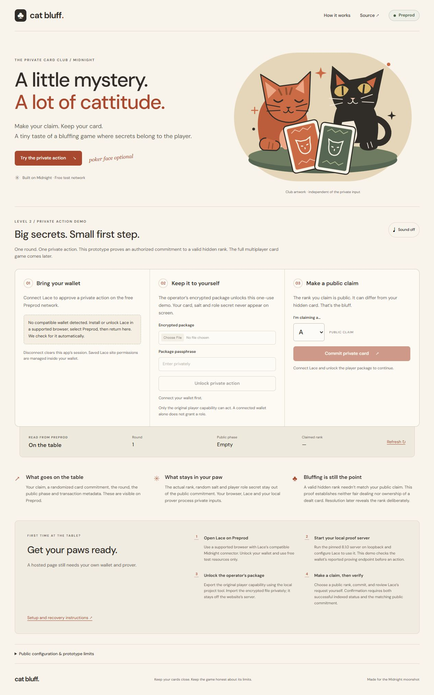
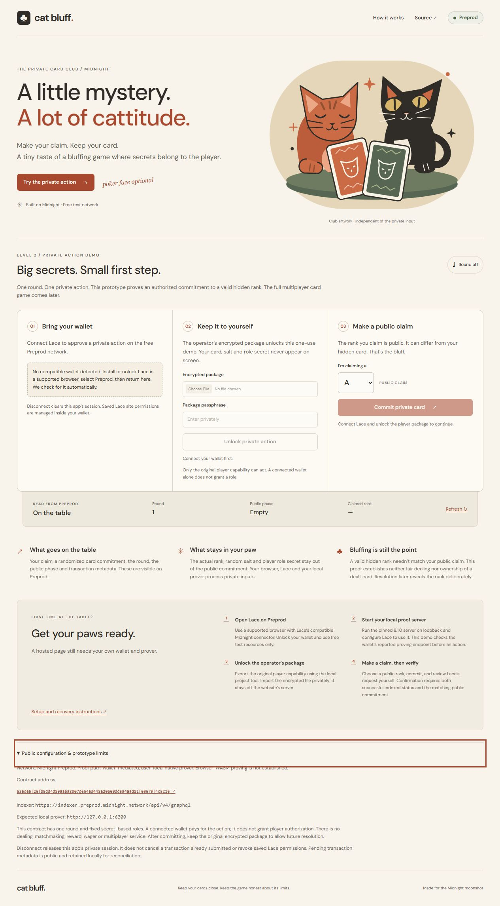
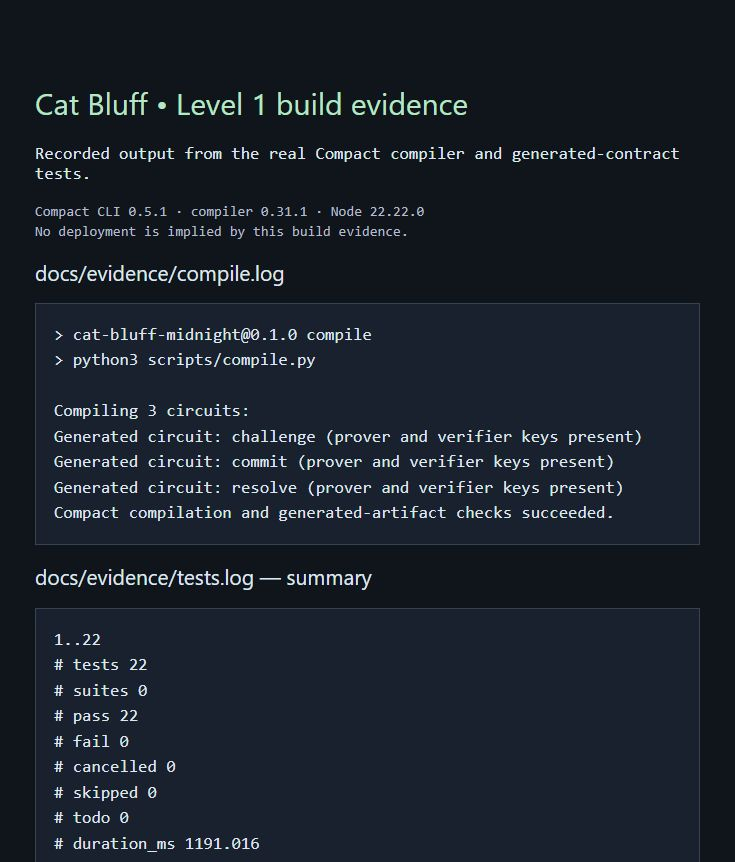
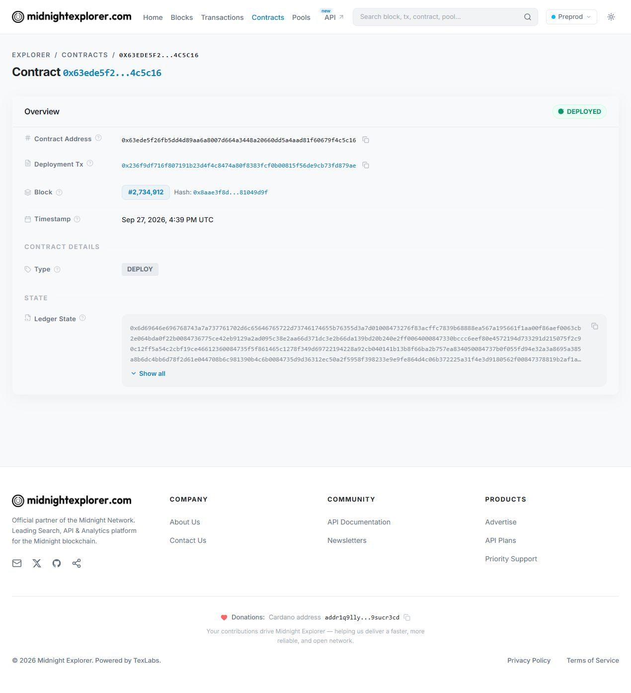

# Cat Bluff


> A private-card bluffing prototype on Midnight Preprod, with public claims and hidden rank commitments.

Cat Bluff is a multiplayer bluffing card game concept: players make public claims while their actual cards remain hidden. Midnight's programmable privacy lets a player commit to a hidden rank, prove authorized transitions, and selectively reveal the rank after a challenge. The deployed Level 1 prototype implements that foundation for one round. Level 2 is limited to a real Lace/Preprod Private Action Demo; the full 2–4-player, 52-card game remains a later roadmap.

**Status, checked September 29, 2026:** Rise In Level 1 is **Approved / Completed**. The operator now reports Level 2 **Approved**; this report has not been independently checked in Rise In. Level 3 engineering and its allowed-list [product proposal](PROPOSAL.md) are prepared; neither Level 3 idea approval nor a Level 3 submission is claimed. The React frontend is published, its public Preprod state read works, and all hosted circuit/WASM assets passed integrity checks. The Level 3 code passed local checks and [Linux CI](https://github.com/AyushPaul26/cat-bluff-midnight/actions/runs/36561726479), and the new guidance was found in the [public Vercel bundle](https://cat-bluff-midnight.vercel.app/assets/App-COTKYbr7.js). [Real Lace connection](docs/evidence/level2-lace-connection.md) was verified by the operator's screenshot, but a later retry failed with `connect.status/Rejected`. **Disconnect/reconnect, a frontend circuit transaction, the actual proving path and a demo video remain unverified.** See the [Level 2 plan](docs/LEVEL_2_PLAN.md), [Level 2 evidence](docs/LEVEL_2_SUBMISSION.md) and [Level 3 checkpoint](docs/LEVEL_3_SUBMISSION.md).

## Live Demo

[Open Cat Bluff](https://cat-bluff-midnight.vercel.app). The hosted screen displayed Preprod round 1 in Empty phase. Its nine circuit artifacts and three WASM files passed [latest hosted asset verification](docs/evidence/level2-connection-diagnostic-hosted-assets.log). The inspection browser had no Lace injection; this is public-read and hosting evidence, not a verified wallet transaction.

[PR #1](https://github.com/AyushPaul26/cat-bluff-midnight/pull/1) is merged into
default `main` at `c462dabd1e9e0115f3d35408ffe03993e150aa86`, preserving all
six Level 2 development commits (17 meaningful non-merge commits at that merge).
At the recorded check, the merge-triggered production deployment was **Ready**
and served that commit at the live alias. [Initial publication record](docs/evidence/level2-main-publication.json).
The later Blockfrost compatibility version at `014eec4` was **Ready** and served
at the live alias. The current connection-diagnostic version at `515af18` is
**Ready** and includes that fix. [Current publication record](docs/evidence/level2-connection-diagnostic-publication.json)
and [delivered-code check](docs/evidence/level2-connection-diagnostic-hosted-code.json).
The Level 3 frontend change at `78170e9` is also Ready in production;
the [current publication record](docs/evidence/level3-publication.json) verifies
its delivered guidance and passing CI without claiming a wallet transaction.

## Demo Video

Not recorded. The [recording script](docs/LEVEL_2_SUBMISSION.md#proposed-recording-script-under-two-minutes) is preparation, not submission evidence.

## Contract Address

| Network | Address |
| --- | --- |
| Preprod | `63ede5f26fb5dd4d89aa6a8007d664a3448a20660dd5a4aad81f60679f4c5c16` |

## What This Does

The current dApp lets an authorized player make a public card-rank claim while committing to a hidden rank. The Compact contract checks that the hidden rank is valid and that the player knows the assigned role capability. A challenger can later trigger resolution, which deliberately reveals the rank and whether the claim was truthful. The deployed contract supports one fixed round; it is a working protocol prototype, not a multiplayer service or a general allowlist.

**Confirmed contract:** [`63ede5f26fb5dd4d89aa6a8007d664a3448a20660dd5a4aad81f60679f4c5c16`](https://preprod.midnightexplorer.com/contracts/0x63ede5f26fb5dd4d89aa6a8007d664a3448a20660dd5a4aad81f60679f4c5c16)

Deployment succeeded in block **2,734,912**, with transaction ID `009987c5cac7b5ebd9176f885dcf012358e1ab705d79548519cd4faff4ad8870e8`. The indexed initial state and all three verifier keys match this project's generated contract. [Transaction explorer](https://preprod.midnightexplorer.com/transactions/0x236f9df716f807191b23d4f4c8474a80f8383fcf0b00815f56de9cb73fd879ae) · [Verification metadata](docs/evidence/deployment.json).

## Contract behavior

| Phase | Authorized action | Result |
| --- | --- | --- |
| Empty | Player calls `commit(claim)` | Checks hidden rank and public claim are 1–13; publishes salted commitment and claim |
| Committed | Challenger calls `challenge()` | Opens the resolution phase |
| Challenged | Player calls `resolve()` | Verifies the original opening, publishes rank and whether the claim was truthful |
| Resolved | No further actions | Terminal state rejects replay |

The claimed rank can differ from the hidden rank. Authorization proves knowledge of a role secret bound to the game context; it does not assert a wallet identity. Deployment creates distinct player and challenger role commitments. The local CLI is a trusted setup/demo operator holding both secrets. A future multiplayer client must distribute those capabilities securely to separate participants.

## Privacy Model

- **PUBLIC:** game context, round, phase, role commitments, salted card commitment, claimed rank and transaction metadata. Resolution deliberately publishes the actual rank and truth result.
- **PRIVATE:** player/challenger capability secrets, unrevealed rank and random salt. They remain with the actor's local environment; the browser, wallet and local prover must be trusted with inputs they process.
- **PROVED without revealing:** at commitment, knowledge of the assigned player capability and a valid hidden rank in 1–13. The proof does not establish fair dealing, wallet identity or truthfulness of the public claim.

Public ledger fields are `gameContext`, `round`, `phase`, `player`, `challenger`, `commitment`, `claimedRank`, `revealedRank`, and `truthful`. `revealedRank` is zero until resolution; `truthful` only has meaning once resolved.

Fresh local ranks use Node crypto.randomInt(1, 14), and salts use 32 cryptographically random bytes. This is local randomness, not a proof of fair dealing. Private witnesses are the acting role's `secret`, the actual `rank`, and its fresh 32-byte `salt`. The application stores these locally under ignored `.private/`. Never publish that directory. The encrypted private-state database password and dedicated test wallet seed also remain there. Anyone with access to the local secrets can act as either role; this prototype does not provide encrypted wallet recovery storage.

`persistentCommit` uses domain separation (`cat-bluff:card:v1` versus `cat-bluff:role:v1`). Card commitments bind the context, round, player commitment, rank, and fresh high-entropy salt. A rank has only 13 possible values, so the unpredictable salt is essential. Role commitments bind context and role number to an independent secret. The single fixed round and terminal phase reject repeated actions.

`disclose()` is deliberate: constructor context/role commitments are public; commitment and claimed rank become public during commit; verified actual rank and truth result become public during resolution. The salt and role secrets are never disclosed. The [contract's opening comment](contracts/cat-bluff.compact) and [design](docs/DESIGN.md) document this boundary.

## Privacy Claim

At commitment time, an on-chain observer sees an authorized transition, a public
claim and a randomized card commitment. The circuit constrains the hidden rank
to 1–13 without publishing that rank, its salt or the player capability. The claim
may differ from the hidden rank; fair dealing and card ownership are not proved.
Resolution deliberately publishes the rank later. A prover processes private
inputs and must be trusted. The implemented Level 2 flow requires a wallet-reported
loopback prover, keeps witnesses in memory outside the UI, and calls only `commit`.
Actual Lace/prover traffic and hosted-origin local-prover access remain unverified. Native
local proving is not browser-WASM proving; the prompt book's literal browser
requirement needs clarification. See [privacy model](docs/PRIVACY_MODEL.md).

## Level 2 Private Action Demo

The screen has real wallet discovery/connection/disconnection, a shielded-address
display, encrypted player-package import, an independent public rank selector,
and the generated Compact `commit` circuit integration. It loads live public
ledger state and verifies all three on-chain verifier keys against served
artifacts. A missing configuration, wrong network, unavailable wallet or failed
public verification cannot produce a success badge.

The player capability, rank and salt never enter React state, rendered content,
URLs, artwork, sound or public pending records. The human creates the encrypted
package from the preserved Level 1 record in an interactive terminal. Its
passphrase is cleared from the form after use; witnesses remain only in memory
for that wallet session. No wallet seed is included. Retain the original record
and package for later resolution. Disconnect attempts to wipe this app's copies,
but JavaScript cannot guarantee complete memory erasure.

Only the original player capability can commit. Connecting Lace does not grant
a game role. **This deployed contract supports one round and no reset.** Reserve
the first real commitment for the hosted recording. Subsequent visitors can read
the public result, but cannot replay the action.

Actual SDK boundaries drive the processing stages. The finalized transaction
identifier is saved before submission. Confirmation requires `SucceedEntirely`
and the expected commitment, public claim and Committed phase at the indexed
block. Unknown outcomes stay pending; recheck the same transaction before any
retry. Web Locks serialize actions across tabs. Unsupported browsers fail closed.
No wallet requests are approved automatically.

### Run locally

For free wallet funding, connect Lace on Preprod, then choose **Show faucet
address** in the wallet panel. It reads and validates the connected wallet's
unshielded `mn_addr_preprod1…` address on demand. Use **Copy faucet address**
and **Open free Preprod faucet**; complete the faucet's CAPTCHA personally.
The shielded address shown above it is a different address type. This fallback
also works when Lace's Receive screen shows only the shielded address. After
tNIGHT arrives, use **Generate tDUST** in Lace and review/approve it yourself.
The address control does not sign or submit anything and forgets its displayed
value when the dApp session ends. The operator's **5,000 tNIGHT receipt and DUST
registration are confirmed on-chain**, including the correct DUST destination
and an initial output. Lace 2.4.1 still shows Syncing 99%; spendable wallet DUST
and the Cat Bluff circuit call remain unverified. Do not repeat registration
solely because the wallet still displays zero. [Funding evidence](docs/evidence/level2-lace-funding.md)
and [procedure](docs/DEPLOYMENT.md#lace-funding).

After installing the pinned toolchain and dependencies below, use Node 22.22.0:

```bash
npm run dev           # http://127.0.0.1:5173
npm run test:ui       # mocked wallet/adapter UI tests
npm run lint
npm run build         # both typechecks + public artifact copy + Vite
npm run preview       # http://127.0.0.1:4173
node scripts/verify-web-assets.mjs http://127.0.0.1:4173
```

On this Windows checkout, select the project-local runtime before npm commands:

```powershell
$env:PATH = (Join-Path (Get-Location) '.tools/node-v22.22.0-win-x64') + ';' + $env:PATH
```

For initial dependency installation, use `bash scripts/install-dependencies.sh`
inside WSL. It bootstraps npm **11.11.1** locally to avoid an observed npm 10
optional-peer resolver failure. It does not change global npm. The lockfile
preserves the Midnight versions; Vercel also uses the pinned npm 11 resolver.
Run compilation in Linux/WSL. Browser build commands work on Windows too.

For the human operator, after starting Docker Desktop's Linux engine:

```bash
docker compose up -d
curl --fail http://127.0.0.1:6300/health
npm run demo:export   # private interactive terminal; password is not echoed
```

The encrypted output is `.private/cat-bluff-demo.enc.json`; it is never uploaded
to hosting. Configure Lace for Preprod and the loopback proof server at
`http://127.0.0.1:6300`. The actual Lace 2.4.1 settings show the equivalent
`http://localhost:6300` prover and current Blockfrost Preprod hosts. The deployed
gate was based on older endpoint documentation; support for the observed hosts
now passes local validation and independent review and is **published at
`014eec4`**, with GitHub CI passing for that exact revision. See the
[endpoint audit](docs/evidence/level2-blockfrost-compatibility.md). The dApp uses
Midnight's official public indexer. Once compatibility and synchronization are
verified, connect Lace,
import the package, choose a public claim, and personally review the wallet request.
Use the verified live origin for this one-time transaction and its recording.
Each visitor needs their own proving prerequisites; hosting supplies no prover.
Exact setup/recovery and hosting instructions: [DEPLOYMENT.md](docs/DEPLOYMENT.md).

### Verification

- **99 Node tests passed locally**, including the original real generated-contract tests,
  wallet lifecycle, encrypted-package rejection, and pending recovery tests.
- **20 UI/hook tests passed locally** with mocked wallet/transaction adapters. These do
  not establish a real Lace transaction or inspect its actual proof payloads.
- Both TypeScript targets, ESLint and the production build passed. The browser
  loaded real WASM, fetched Preprod state and matched its verifier keys.
- Nine circuit artifacts and three WASM files passed served-byte/hash checks.
- The [published frontend](https://cat-bluff-midnight.vercel.app) loaded public
  Preprod state, and its nine circuit artifacts and three WASM files passed the
  same [hosted checks](docs/evidence/level2-connection-diagnostic-hosted-assets.log) at `515af18`.
- Desktop and 390-pixel mobile viewports were inspected. No mobile horizontal
  overflow was observed. Missing-wallet controls stayed disabled.

[Node tests](docs/evidence/level2-connection-diagnostic-full-node.log) ·
[UI tests](docs/evidence/level2-connection-diagnostic-full-ui.log) ·
[build/typechecks](docs/evidence/level2-connection-diagnostic-build.log) ·
[lint](docs/evidence/level2-connection-diagnostic-lint.log) ·
[endpoint regression](docs/evidence/level2-blockfrost-endpoint-tests.log) ·
[asset checks](docs/evidence/level2-assets.log).

A small connection diagnostic is published at `515af18`: failed connection or
session validation can show an optional support code containing only the fixed
operation name and an allowlisted connector error code. It exposes no raw
wallet error fields and performs no logging or persistence. A real retry on
September 29 returned `connect.status/Rejected` in a previously authorized
Lace session and again after restarting the extension. This identifies the
rejected API call, not its underlying cause. Lace connection, synchronization, spendable DUST,
real proving and a Cat Bluff transaction remain unverified.
[Diagnostic evidence: 99 Node / 20 mocked UI tests, types, lint and build](docs/evidence/level2-connection-diagnostic.md).

The earlier [Lace 2.4 compatibility validation](docs/evidence/level2-lace-compatibility.log)
added four endpoint regression tests and recorded 79 Node / 15 mocked
UI tests, both typechecks, lint and build. Those results and the 75-test logs remain
historical evidence. The [local proof server health](docs/evidence/level2-proof-server.json)
is verified; real wallet-mediated proving is still pending.

A [fresh isolated Windows install/build](docs/evidence/level2-clean-build.log)
also passed with npm 11.11.1 and `ci --include=dev --ignore-scripts`; no Compact
installation or private file was needed in the build copy. The Vercel production
build installed 660 packages and passed both typechecks and Vite. A subsequent
[hosted build log](docs/evidence/level2-vercel-build.log) explicitly records
Node **22.23.2** and npm **11.11.1**, within the configured Node 22.x range. The
[latest completed Linux CI run](https://github.com/AyushPaul26/cat-bluff-midnight/actions/runs/36465711677)
also passed: Node 22.22.0, Compact CLI 0.5.1/compiler 0.31.1, all three circuits,
99 Node tests, 20 mocked UI tests, types, lint and production build at `515af18`.
The correction's local checks also passed: **92 Node tests, 7 focused
endpoint tests, 18 mocked UI tests, both typechecks, lint and production build**.
An independent review found no blockers. The fix is committed and published at
`014eec4`, with the same revision verified in CI. These
checks do not establish a real wallet proof or transaction.
[Local browser evidence](docs/evidence/level2-browser.json) records the real
public read and disabled action in the absence of Lace. Hosting success does
not establish a real Lace proof or transaction.

A real Lace authorization exposed an unnecessary `hintUsage` method check.
The [post-authorization compatibility fix](docs/evidence/level2-wallet-api-fix.md)
preserves all wallet operations and session checks. Its verification passed
81 Node tests, 15 mocked UI tests, both typechecks, lint and build; the operator
subsequently verified a real connection. Disconnect/reconnect remains pending.





The bundle includes large Midnight WASM files and an approximately 830 KB
application JS chunk; production compression/caching matter. Build warnings
about that chunk and an upstream PURE comment remain visible in the log.
Cat Bluff wallet approval, proof generation, actual private traffic inspection, hosted-origin
local-network access, video and submission are still pending.

## Tech Stack

Midnight Preprod, Compact, Midnight.js, the Lace connector, React, TypeScript, Vite, Node.js 22 and a user-local Docker proof server. Versions are pinned below.

## Prerequisites

Use a supported browser with Lace on Preprod for wallet actions. Local development and compilation require Linux x86-64 or Ubuntu on WSL2, Python 3, curl and Docker with a running Linux engine. The private-action demo also requires the operator's encrypted package and a reachable local proof server. Do not enter wallet recovery words or a package passphrase into a hosted support form.

## Setup & Run Locally

Use Linux x86-64 or Ubuntu on WSL2, Python 3, curl, and Docker with a running Linux engine. On Windows, complete Ubuntu's first-launch username/password prompt yourself. Run project commands from this repository root inside Ubuntu. Windows' system `compact.exe` is unrelated to Midnight.

| Component | Pinned version |
| --- | --- |
| Node.js | 22.22.0 |
| Compact CLI | 0.5.1 |
| Compact compiler | 0.31.1 |
| Compact runtime | 0.16.0 |
| Midnight.js | 4.1.1 |
| Proof server | 8.1.0 |
| Wallet SDK umbrella | 1.2.0 |
| TypeScript | 5.9.3 |
| DApp Connector API | 4.0.1 |
| React / React DOM | 19.2.4 |
| Vite / React plugin | 7.3.1 / 5.1.4 |
| Project-local npm resolver | 11.11.1 |

Versions were selected from the official [support matrix](https://docs.midnight.network/relnotes/support-matrix) for Preprod. The CLI version is different from the compiler version. Exact transitive JavaScript versions are captured in `package-lock.json`.

```bash
bash scripts/bootstrap-tools.sh
source scripts/env.sh
bash scripts/install-dependencies.sh
npm run compile
npm run typecheck
npm test
```

Tools install into ignored `.tools/`, without changing global Node. The setup extractor avoids unsupported chmod/timestamp changes on Windows-mounted paths, and quotes the compiler launcher's path to support usernames containing spaces. Compiler binaries and generated artifacts are unchanged. Dependency installation avoids npm executable-link failures and explicitly validates bundled native modules.

After setup, run `npm run dev` and open `http://127.0.0.1:5173`. To produce the static release, run `npm run build`. Wallet connection and a circuit transaction additionally require the operator's Preprod resources described in [deployment instructions](docs/DEPLOYMENT.md).

Compilation builds in a fresh temporary directory then copies real compiler output to `managed/cat-bluff/`. All three circuits (`commit`, `challenge`, `resolve`), `.prover` keys, `.verifier` keys and generated contract JavaScript are included. Never hand-edit generated output.

## Run Tests

```bash
npm test
npm run test:ui
npm run typecheck
npm run lint
npm run build
```

`npm test` executes the generated contract and application tests. UI tests simulate wallet responses; they do not replace a real Lace, prover or Preprod transaction test.

## CI/CD

The [GitHub Actions workflow](.github/workflows/ci.yml) runs on pushes to `main` and pull requests. It installs the pinned toolchain and dependencies, recompiles all three Compact circuits, and runs contract/application tests, UI tests, both TypeScript checks, lint and a production build. The badge at the top reflects the workflow's latest result; a green badge validates the checked commit's automation, not the pending real-wallet circuit flow.

## Product Proposal

[PROPOSAL.md](PROPOSAL.md) selects **Private Allowlist Access** from the Level 3 list and explains how the current role-capability prototype could become invite-only tables. This is a proposed next product, awaiting organizer approval; current Cat Bluff does not yet implement dynamic allowlist membership.

## Verification evidence

Behavioral tests run the real generated contract and shared application witnesses. They cover initial state, valid bluff and truthful claims, wrong capabilities/openings, rank bounds, phase violations/replay, context/round binding, and the public/private boundary. These tests validate contract execution; they do not establish network deployment or complete zero-knowledge privacy on their own.

- [Genuine compilation log](docs/evidence/compile.log)
- [Genuine behavioral test log](docs/evidence/tests.log)
- [Compilation and test screenshot](docs/evidence/compile-tests.png)
- [Confirmed deployment log](docs/evidence/deployment.log)
- [Indexer verification screenshot](docs/evidence/deployment.png)
- [Explorer deployment screenshot](docs/evidence/explorer-contract.png)
- [Linux CI record, including exact tested commit](docs/evidence/ci.json)





## Proof server and deployment

```bash
npm run proof:up
curl --fail http://127.0.0.1:6300/health
npm run wallet:address
# Request free tokens for the printed public address in the faucet UI.
npm run deploy
```

The proof server is bound to localhost. Use only the official free [Preprod faucet](https://midnight-tmnight-preprod.nethermind.dev/). CAPTCHA or login must be completed by the user. Never fund this prototype with mainnet assets or purchased tokens.

`wallet:address` creates or reuses one dedicated local wallet and prints only its public address. `deploy` checks proof-server health, synchronizes the wallet, registers test NIGHT for dust if necessary, submits the custom constructor, waits for confirmation, and checks the indexed ledger and all three on-chain verifier keys. Only after those checks does it write `docs/evidence/deployment.json`. A saved deployment receipt prevents accidental duplicate deployment.

A fresh wallet must replay Preprod's dust history; the first synchronization can take tens of minutes. Supported SDK batching improves throughput without skipping events. A private checkpoint under `.private/` is saved on completion or handled failure and restored on the next run after checking the network and wallet address. Do not run multiple wallet commands concurrently. Checkpoints contain private wallet state and must never be published. The CLI allows up to one hour for synchronization and reports public progress counters.

Windows-mounted WSL directories can make SDK imports unusually slow. The same pinned Node release can run the wallet/deployment CLI directly in PowerShell:

```powershell
powershell -File scripts/setup-windows-node.ps1
& ./.tools/node-v22.22.0-win-x64/node.exe --experimental-strip-types src/wallet-address.ts
& ./.tools/node-v22.22.0-win-x64/node.exe --experimental-strip-types src/deploy.ts
```

Keep compilation in Ubuntu. The native wallet CLI uses the same project files, private state and pinned dependencies. The [faucet funding](docs/evidence/faucet-confirmation.json), [dust registration](docs/evidence/dust-registration.json), and [custom deployment](docs/evidence/deployment.json) were separately confirmed.

Before fee balancing, the CLI waits for wallet synchronization and saves `.private/wallet-before-balance.json`. It records public transaction identifiers locally before submission. A failed or interrupted submission must be checked against the indexer before any retry or snapshot restoration. The first deployment attempt was rejected with node error 170; its local dust reservation was recovered using the pinned ledger API, with unchanged Merkle roots, before a fresh transaction succeeded. See [deployment notes](docs/DEPLOYMENT.md). Do not automatically restore old wallet snapshots after transactions that may have reached the chain.

## Limitations and Level 2

This prototype does not prove fair dealing, card uniqueness, unique players, wallet ownership, shuffle randomness, or honesty of the trusted setup. A player can withhold resolution. There are no timeouts, scoring, stakes, payouts, multiple simultaneous rounds, or multiplayer networking.

Level 2 implements a focused private-action interface, Lace connector support,
scoped in-memory private state, encrypted operator provisioning and transaction
progress. Real Lace execution and a confirmed frontend commitment remain to be
verified. The current address has one fixed
round and no reset; general visitors will inspect its public result. Multiplayer
hands, challenge/reveal gameplay, further rounds and timeouts remain later work.

## Submission and license

Level 1 was submitted for September review on September 27, 2026, with the
user-selected five-star rating. The September 28 browser audit showed Approved,
Completed and the correct repository. The older [submission screenshot](docs/evidence/rise-submission.png)
and [final Level 1 audit](docs/FINAL-AUDIT.md) preserve the original pending-review
state. The operator reports Level 2 approval on September 29; this has not
been independently checked in Rise In. The Level 3 task also requires an
approved idea from its list, so its [submission checkpoint](docs/LEVEL_3_SUBMISSION.md)
remains open. September is active through September 30; the page does not state
an exact cutoff time or timezone. Wallet setup, passwords and approvals remain
personal actions. A genuine real-wallet circuit call and recording are still
needed for Level 3 evidence.

Apache-2.0. See [LICENSE](LICENSE) and [third-party notices](THIRD-PARTY-NOTICES.md).
